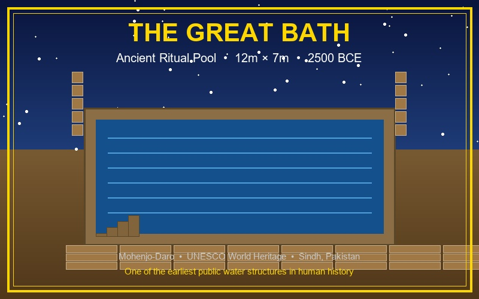
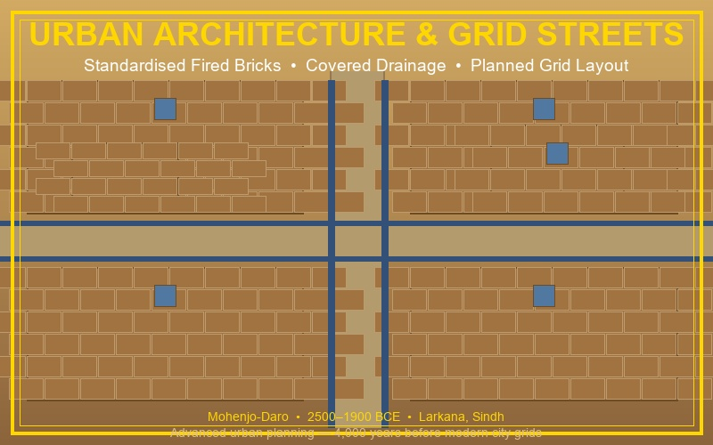
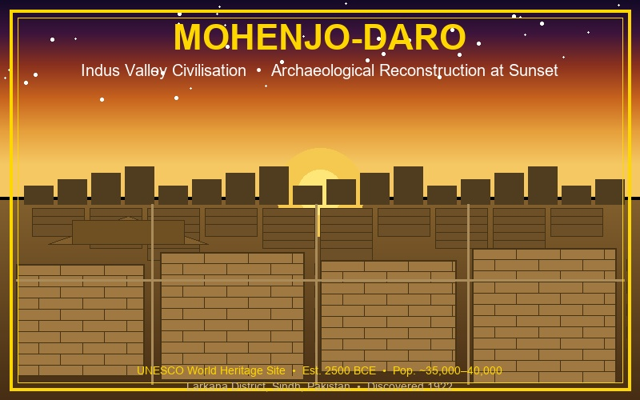

# 🏛️ Mohenjo-Daro Heritage AI Chatbot

An AI-powered chatbot and image gallery for exploring the ancient Indus Valley Civilisation site of **Mohenjo-daro** — a UNESCO World Heritage Site located in Larkana District, Sindh, Pakistan.

Built with **Python**, **Streamlit**, and **Google Gemini 2.5 Flash**, this app lets users ask natural-language questions about the site's history, architecture, and preservation, with contextual heritage visuals displayed alongside answers.


---

## ✨ Features

- **AI Chatbot** — Conversational interface powered by Google Gemini 2.5 Flash, grounded in a curated Mohenjo-daro knowledge base
- **Knowledge-Base Grounding** — Simplified RAG approach using a structured Python dictionary built from UNESCO, Britannica, and academic sources; reduces hallucinations and keeps answers accurate
- **Contextual Image Gallery** — Three heritage visuals (the Great Bath, city streets & drainage, aerial city overview) that auto-display based on what the user asks about
- **Sample Q&A Generator** — One-click generation of five sample questions and answers for demonstration
- **Clean Streamlit UI** — Wide-layout interface with sidebar site info, API status, and visual question shortcuts

---

## 🖼️ Visual Outputs

The app includes three contextual heritage visuals that auto-display based on what the user asks about.

---

### 🛁 The Great Bath


> **Trigger keywords:** bath, pool, water, ritual  
> One of the earliest public water structures in human history. The Great Bath measures approximately **12m × 7m × 2.4m deep**, built with precisely laid fired bricks and a sophisticated waterproofing system. Scholars believe it served ritual, civic, or public bathing purposes around **2500 BCE**.

---

### 🏗️ Urban Architecture & Grid Streets


> **Trigger keywords:** street, urban, planning, grid, drainage, architecture, brick, building  
> Mohenjo-daro was laid out on a precise **north–south / east–west grid**, with standardised fired-brick construction across all structures. Covered drainage channels ran beneath the streets — a level of urban sanitation engineering unmatched in the ancient world for its time.

---

### 🏛️ City Overview — Archaeological Reconstruction


> **Trigger keywords:** overview, aerial, full city, ancient, reconstruction, appearance, past  
> A reconstruction of Mohenjo-daro at sunset, showing the city's dense multi-storey residential blocks, wide main avenues, and the elevated Citadel quarter. At its peak (~2500 BCE) the city housed an estimated **35,000–40,000 people**, making it one of the largest urban settlements of the ancient world.

---

## 🗂️ Project Structure

```
mohenjo-daro-heritage-chatbot/
├── app.py                          # Main Streamlit application
├── heritage-chatbot.jsx            # React UI component
├── mohenjo_daro_great_bath.jpg     # The Great Bath visual
├── mohenjo_daro_architecture.jpg   # Urban architecture & grid streets
├── mohenjo_daro_overview.jpg       # City overview reconstruction
├── .env                            # API key (do not commit — see setup)
├── requirements.txt                # Python dependencies
├── run.sh                          # Quick-start script (Linux/macOS)
├── run.bat                         # Quick-start script (Windows)
└── How_to_run.sh                   # Step-by-step install guide
```

---

## ⚙️ Prerequisites

- Python 3.8 or higher
- A [Google Gemini API key](https://ai.google.dev/) (free tier available)
- Internet connection (for Gemini API calls and image loading)

---

## 🚀 Setup & Installation

### 1. Clone the repository

```bash
git clone https://github.com/your-username/mohenjo-daro-chatbot.git
cd mohenjo-daro-chatbot
```

### 2. Create your `.env` file

Create a file named `.env` in the project root and add your Gemini API key:

```
GEMINI_API_KEY=your_gemini_api_key_here
```

> ⚠️ **Never commit your `.env` file.** Add it to `.gitignore`.

### 3. Install dependencies

**Option A — Automated (recommended):**

*Linux/macOS:*
```bash
bash run.sh
```

*Windows:*
```bat
run.bat
```

**Option B — Manual:**
```bash
pip install -r requirements.txt
streamlit run app.py
```

**Option C — Install one by one (if you hit dependency conflicts):**
```bash
pip install streamlit
pip install google-generativeai
pip install python-dotenv
pip install requests
streamlit run app.py
```

### 4. Open in browser

The app will open automatically at:
```
http://localhost:8501
```

---

## 💬 How to Use

1. **Ask any question** about Mohenjo-daro in the chat input, e.g.:
   - *"What is the history of Mohenjo-daro?"*
   - *"Tell me about the Great Bath."*
   - *"What preservation challenges does the site face?"*

2. **Ask for visuals** to trigger the image gallery, e.g.:
   - *"Show me the Great Bath"*
   - *"What did the ancient city look like?"*
   - *"Display the urban planning of Mohenjo-daro"*

3. **Load the full image gallery** by clicking **"Load All Heritage Images"** in the sidebar.

4. **Use sidebar shortcut buttons** for quick visual questions.

5. **Generate Sample Q&A** from the right panel to see five demonstration answers.

---

## 📦 Dependencies

| Package | Version |
|---------|---------|
| streamlit | 1.32.0 |
| google-generativeai | 0.8.3 |
| Pillow | 10.1.0 |
| python-dotenv | 1.0.0 |
| requests | 2.31.0 |

---

## 🏺 About Mohenjo-daro

Mohenjo-daro (*"Mound of the Dead Men"* in Sindhi) was one of the largest cities of the **Indus Valley Civilisation**, flourishing around **2500–1900 BCE**. Rediscovered in 1922 by R. D. Banerji, it was inscribed on the **UNESCO World Heritage List in 1980**. The city is renowned for its grid-based urban layout, standardised fired-brick construction, sophisticated drainage system, and the iconic Great Bath. At its peak it is estimated to have housed 35,000–40,000 people, making it one of the great urban centres of the ancient world.

---

## 🛠️ Technical Architecture

```
User Query
    │
    ▼
Knowledge Base (keyword match)
    │
    ▼
System Prompt + Retrieved Context
    │
    ▼
Google Gemini 2.5 Flash (google-generativeai)
    │
    ▼
Chatbot Response  ──►  Image Trigger Logic  ──►  Contextual Visual
    │
    ▼
Streamlit UI (chat + sidebar + gallery)
```

The chatbot follows a **simplified Retrieval-Augmented Generation (RAG)** pattern: relevant knowledge-base content is retrieved via keyword matching and injected into the prompt before each Gemini API call, keeping answers grounded and reducing hallucinations.

---

## 🔒 Security Notes

- API keys are loaded from `.env` using `python-dotenv` and never hardcoded in source files.
- Add `.env` to your `.gitignore` before pushing to any public repository.

---

## 🔭 Future Improvements

- Expand the knowledge base to cover related Indus Valley sites (Harappa, Taxila)
- Add Urdu and Sindhi language support
- Integrate a live image-generation model (DALL-E, Stable Diffusion) to replace static gallery images
- Deploy to Streamlit Cloud or Hugging Face Spaces for public access

---

## 📚 Key References

- [UNESCO — Archaeological Ruins at Moenjodaro](https://whc.unesco.org/en/list/138)
- [Encyclopaedia Britannica — Mohenjo-daro](https://www.britannica.com/place/Mohenjo-daro)
- [Google Gemini API Documentation](https://ai.google.dev/docs)
- [Streamlit Documentation](https://docs.streamlit.io)

---

## 📄 License

This project is licensed under the [MIT License](LICENSE) — feel free to use, modify, and distribute it with attribution.
